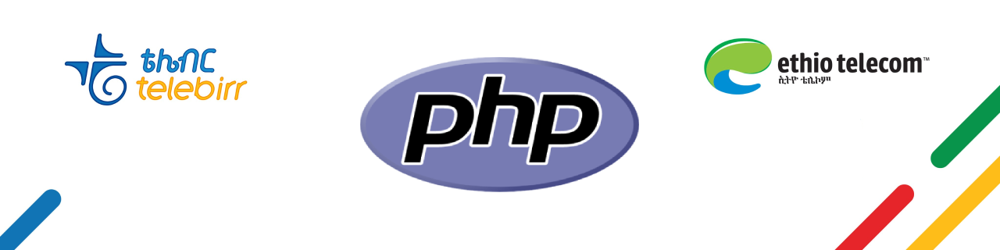

<a href="https://aimeos.org/">
    
</a>


# Telebirr Php library v 0.1



Telebirr-Php is a php library for [telebirr](https://www.ethiotelecom.et/telebirr/).  
Telebirr is a mobile money service developed by Huawei that is owned and was launched by Ethio telecom.  
This library will help you by providing an easy integration method so you can focus on your main task

## Table of content

- [Installation](#installation)
  - [Composer](#composer)
- [Usage](#usage)
## Requirements
- PHP >= 5.3.7
- cURL Extension
- 
## Installation
### Composer
``` 
composer require melaku/telebirr 
```

## Usage

### after payment decode willbe added soon!
